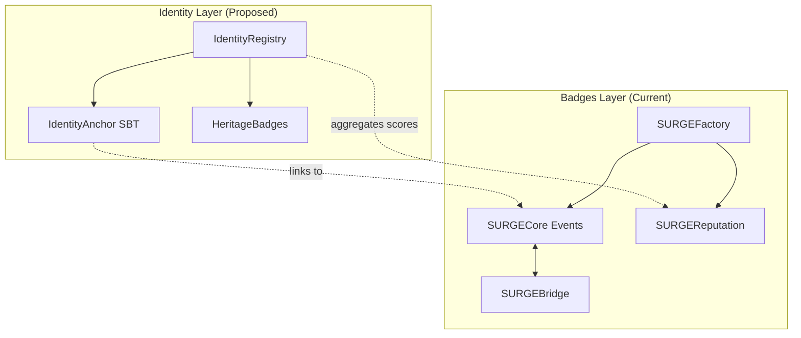

# SURGE me UP — Project Architecture

> **Document Purpose:** Central coordination file for all agents and contributors. Contains project overview, architecture, deployment status, and agent task log.

---

## 1. Project Overview

**SURGE** = **S**uperchain **U**ser **R**ecognition and **G**rowth **E**ngine

SURGE me UP is a platform for creating, distributing, and managing recognition tokens (badges) on the Optimism Superchain ecosystem. It enables:

- AI-powered badge generation
- Multi-network minting (Base, OP, Celo, Zora, etc.)
- Creator reputation system
- Cross-chain bridging via OP Stack native messaging

### Live Deployment

- **Frontend:** <https://surge-me-up.vercel.app>
- **GitHub:** (private repository)
- **Smart Contracts:** Deployed on 8 networks

---

## 2. Current Architecture

### Smart Contracts (Deployed)

```
smart-contracts/contracts/
├── SURGECore.sol          # ERC-721 NFT per event
├── SURGEFactory.sol       # Event deployment & creator management
├── SURGEReputation.sol    # Creator reputation, flagging, bans
├── SURGEBridge.sol        # Cross-chain bridging (L2→L2)
└── interfaces/
    └── IL2ToL2CrossDomainMessenger.sol
```

| Contract | Description | Networks |
|----------|-------------|----------|
| SURGECore | Individual event NFT contract | Per-event deployment |
| SURGEFactory | Creator registry, event factory | All 8 networks |
| SURGEReputation | Reputation scoring, flags, appeals | All 8 networks |
| SURGEBridge | Cross-chain token bridging | All 8 networks |

### Deployment Networks (8 Mainnet)

| Network | Chain ID | Status |
|---------|----------|--------|
| Base | 8453 | ✅ Deployed |
| Optimism | 10 | ✅ Deployed |
| Celo | 42220 | ✅ Deployed |
| Zora | 7777777 | ✅ Deployed |
| Ink | 57073 | ✅ Deployed |
| Lisk | 1135 | ✅ Deployed |
| Unichain | 130 | ✅ Deployed |
| Soneium | 1868 | ✅ Deployed |

### Testnet Networks

| Network | Chain ID | Status |
|---------|----------|--------|
| Base Sepolia | 84532 | ✅ Testnet |
| Optimism Sepolia | 11155420 | ✅ Testnet |
| Celo Alfajores | 44787 | ✅ Testnet |

### Frontend Stack

- **Framework:** Next.js 14 with TypeScript
- **Styling:** Tailwind CSS
- **Wallet:** wagmi + ConnectKit
- **Storage:** IPFS for metadata

---

## 3. Identity Layer (RFC-001)

> **Status:** ✅ Contracts Implemented

New layer to add multi-wallet identity, compromise protection, and reputation preservation.

### Identity Contracts

| Contract | Purpose | Status |
|----------|---------|--------|
| IdentityAnchor.sol | Soulbound ERC-721, same tokenId per identity | ✅ Implemented |
| IdentityRegistry.sol | Core identity logic: link wallets, compromise flow | ✅ Implemented |
| HeritageBadges.sol | Claim reputation from compromised wallet history | ✅ Implemented |

**Location:** `/smart-contracts/contracts/identity/`

### Architecture Diagram



### RFC Documents

| Document | Path | Status |
|----------|------|--------|
| RFC-001-SURGE-Identity.md | `/docs/rfc/` | ✅ Complete |
| RFC-001-Technical-Spec.md | `/docs/rfc/` | ✅ Complete |
| RFC-001-FAQ.md | `/docs/rfc/` | ✅ Complete |
| RFC-001-Voting-Questions.md | `/docs/rfc/` | ✅ Complete |

### Design Documents

| Document | Path | Status |
|----------|------|--------|
| UI-UX-Specification.md | `/docs/design/` | ✅ Complete |

---

## 4. Agent Coordination Log

> Agents should log their work here after completing tasks.

### 2025-12-11 — RFC Documentation Agent

**Task:** Create SURGE Identity System RFC documentation

**Status:** ✅ COMPLETED

**Completed:**

- [x] Analyzed existing smart contracts (SURGECore, SURGEFactory, SURGEReputation, SURGEBridge)
- [x] Created implementation plan
- [x] Created `/docs/rfc/` directory structure
- [x] Created `Project_Architecture.md`
- [x] Created `RFC-001-SURGE-Identity.md` (11.1 KB) — High-level RFC with motivation, architecture, diagrams
- [x] Created `RFC-001-Technical-Spec.md` (20.3 KB) — Detailed contract specs, state machine, API
- [x] Created `RFC-001-FAQ.md` (9.8 KB) — FAQ for users, developers, partners
- [x] Created `RFC-001-Voting-Questions.md` (8.4 KB) — 9 governance questions with options

**Decisions Made:**

1. Identity System integrates with existing SURGEReputation (not replacement)
2. Identity→Badges connection via off-chain indexer for MVP
3. MVP deployment on Base only; multi-chain documented as Phase 1-2

**Files Created:**

- `/Project_Architecture.md` — Central coordination document
- `/docs/rfc/RFC-001-SURGE-Identity.md` — Main RFC
- `/docs/rfc/RFC-001-Technical-Spec.md` — Technical specification
- `/docs/rfc/RFC-001-FAQ.md` — Frequently asked questions
- `/docs/rfc/RFC-001-Voting-Questions.md` — Governance questions

**Next Steps (for future agents/tasks):**

- Implement IdentityAnchor.sol contract based on RFC-001-Technical-Spec
- Implement IdentityRegistry.sol contract
- Implement HeritageBadges.sol contract
- Community review and voting on RFC questions

---

### 2025-12-11 — UI/UX Design Agent

**Task:** Create SURGE Identity UI/UX Specification

**Status:** ✅ COMPLETED

**Completed:**

- [x] Created `/docs/design/` directory structure
- [x] Created `UI-UX-Specification.md` (28 KB) — Complete UI/UX spec

**Deliverables:**

1. Information Architecture (site map, navigation)
2. Wireframes for all 6 pages:
   - `/identity` — Dashboard
   - `/identity/link` — Wallet Linking
   - `/identity/manage` — Manage Wallets
   - `/identity/badges` — Heritage Badges
   - `/identity/recover` — Future Placeholder
   - `/verify/{wallet}` — Public Verification
3. Visual Design System (colors, typography, components)
4. User Flows (6 flows with mermaid diagrams)
5. Copy & UX Guidelines

**Files Created:**

- `/docs/design/UI-UX-Specification.md` — Complete specification

**Next Steps (for future agents/tasks):**

- Create Figma mockups based on wireframes
- Implement React components
- Add to existing Next.js app

---

### 2025-12-11 — Smart Contracts Agent

**Task:** Implement SURGE Identity smart contracts

**Status:** ✅ COMPLETED

**Completed:**

- [x] Created `/smart-contracts/contracts/identity/` directory
- [x] Created `IdentityAnchor.sol` — Soulbound ERC-721 (7.5 KB)
- [x] Created `IdentityRegistry.sol` — Core identity logic (18 KB)
- [x] Created `HeritageBadges.sol` — Heritage badge claim (14 KB)
- [x] Created `deploy-identity.ts` — Deployment script
- [x] All contracts compiled successfully

**Contract Features:**

1. **IdentityAnchor.sol:**
   - Non-transferable ERC-721 (soulbound)
   - Same tokenId for all wallets in identity
   - Only IdentityRegistry can mint

2. **IdentityRegistry.sol:**
   - Create identity with automatic SBT minting
   - Link wallets with dual-signature verification
   - Primary wallet with 14-day cooldown
   - 30-day compromise dispute period
   - Identity suspension on primary loss

3. **HeritageBadges.sol:**
   - 5 badge types (Veteran, Volume, CrossChain, Maestro, Collector)
   - Claim from compromised wallet history
   - Configurable thresholds

**Files Created:**

- `/smart-contracts/contracts/identity/IdentityAnchor.sol`
- `/smart-contracts/contracts/identity/IdentityRegistry.sol`
- `/smart-contracts/contracts/identity/HeritageBadges.sol`
- `/smart-contracts/scripts/deploy-identity.ts`

**Next Steps (for future agents/tasks):**

- Deploy to Base testnet for testing
- Write unit tests
- Connect frontend to deployed contracts

---

### 2025-12-11 — Frontend Agent

**Task:** Implement SURGE Identity frontend

**Status:** ✅ COMPLETED

**Completed:**

- [x] Created `useIdentity` hook for state management
- [x] Created Identity components (IdentityHeader, WalletCard, StatusChip, AlertBanner, CreateIdentityCard)
- [x] Created `/identity` Dashboard page
- [x] Created `/identity/link` Wallet linking page (3-step flow)
- [x] Created `/identity/manage` Wallet management page
- [x] Created `/identity/badges` Heritage badges page
- [x] Added Identity to navigation
- [x] All pages build successfully

**Files Created:**

- `/src/hooks/useIdentity.ts`
- `/src/components/identity/` (6 components)
- `/src/app/identity/page.tsx`
- `/src/app/identity/link/page.tsx`
- `/src/app/identity/manage/page.tsx`
- `/src/app/identity/badges/page.tsx`

**Next Steps (for future agents/tasks):**

- Connect to deployed smart contracts via wagmi
- Add real wallet linking signatures
- Integrate heritage badge contract calls

---

### 2025-12-11 — UI/UX Redesign Agent

**Task:** Redesign website to match LayerZero Builder UI Kit

**Status:** ✅ COMPLETED

**Completed:**

- [x] Updated `tailwind.config.ts` with new color palette (green `#0ae448`, teal, pink)
- [x] Rewrote `globals.css` with LayerZero-inspired utilities (`.lz-card`, glow effects)
- [x] Updated button component with glow hover effects
- [x] Redesigned navbar and footer with dark theme
- [x] Updated SuperchainEcosystem with per-network glow effects
- [x] Updated ProcessTimeline with gradient path animation
- [x] Updated SURGEExplainer with new card styling
- [x] Updated homepage with real data (8 networks, 0 SURGEs, $0 fee)
- [x] Fixed Tailwind v4 @apply compatibility issues
- [x] Build verified and pushed to GitHub

**Files Modified:**

- `/tailwind.config.ts` — New accent colors and glow shadows
- `/src/app/globals.css` — Complete overhaul with LayerZero utilities
- `/src/app/page.tsx` — Homepage with real data and new styling
- `/src/components/ui/button.tsx` — Glow hover variants
- `/src/components/ui/navbar.tsx` — Dark theme with accent hovers
- `/src/components/ui/footer.tsx` — Real GitHub link, accent styling
- `/src/components/ui/SuperchainEcosystem.tsx` — Network-colored glow on hover
- `/src/components/ui/ProcessTimeline.tsx` — Green-teal-pink gradient
- `/src/components/ui/SURGEExplainer.tsx` — New card styling

**Design Reference:** [LayerZero Builder UI Kit](https://www.behance.net/gallery/212595275/LayerZero-Builder-UI-Kit)

---

## 5. Development Guidelines

### Security (CRITICAL)

- ⚠️ **NEVER** commit `.env` files
- ⚠️ Private keys stored ONLY in local `.env.local`
- ⚠️ All sensitive data excluded via `.gitignore`

### Deployment Flow

1. Local development → `npm run dev`
2. Push to GitHub → auto-deploy to Vercel
3. Verify contract updates on all networks

### Code Style

- Solidity 0.8.20+
- TypeScript strict mode
- ESLint + Prettier enforced

---

*Last Updated: 2025-12-11 by RFC Documentation Agent*
