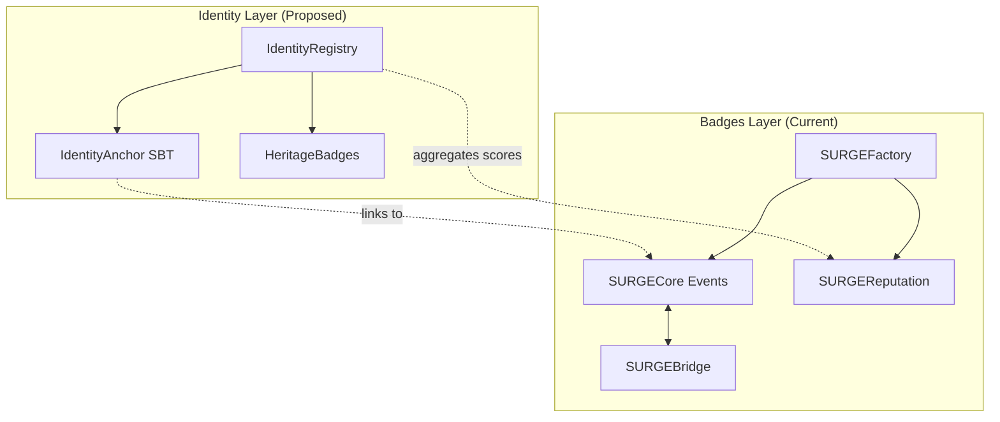

# SURGE me UP — Project Architecture

> **Document Purpose:** Central coordination file for all agents and contributors. Contains project overview, architecture, deployment status, and agent task log.

---

## 1. Project Overview

**SURGE** = **S**uperchain **U**ser **R**ecognition and **G**rowth **E**ngine

SURGE me UP is a platform for creating, distributing, and managing recognition tokens (badges) on the Optimism Superchain ecosystem. It enables:

- AI-powered badge generation
- Multi-network minting (Base, OP, Celo, Zora, etc.)
- Creator reputation system
- Cross-chain bridging via OP Stack native messaging

### Live Deployment

- **Frontend:** <https://surge-me-up.vercel.app>
- **GitHub:** (private repository)
- **Smart Contracts:** Deployed on 8 networks

---

## 2. Current Architecture

### Smart Contracts (Deployed)

```
smart-contracts/contracts/
├── SURGECore.sol          # ERC-721 NFT per event
├── SURGEFactory.sol       # Event deployment & creator management
├── SURGEReputation.sol    # Creator reputation, flagging, bans
├── SURGEBridge.sol        # Cross-chain bridging (L2→L2)
└── interfaces/
    └── IL2ToL2CrossDomainMessenger.sol
```

| Contract | Description | Networks |
|----------|-------------|----------|
| SURGECore | Individual event NFT contract | Per-event deployment |
| SURGEFactory | Creator registry, event factory | All 8 networks |
| SURGEReputation | Reputation scoring, flags, appeals | All 8 networks |
| SURGEBridge | Cross-chain token bridging | All 8 networks |

### Deployment Networks (8 Mainnet)

| Network | Chain ID | Status |
|---------|----------|--------|
| Base | 8453 | ✅ Deployed |
| Optimism | 10 | ✅ Deployed |
| Celo | 42220 | ✅ Deployed |
| Zora | 7777777 | ✅ Deployed |
| Ink | 57073 | ✅ Deployed |
| Lisk | 1135 | ✅ Deployed |
| Unichain | 130 | ✅ Deployed |
| Soneium | 1868 | ✅ Deployed |

### Testnet Networks

| Network | Chain ID | Status |
|---------|----------|--------|
| Base Sepolia | 84532 | ✅ Testnet |
| Optimism Sepolia | 11155420 | ✅ Testnet |
| Celo Alfajores | 44787 | ✅ Testnet |

### Frontend Stack

- **Framework:** Next.js 14 with TypeScript
- **Styling:** Tailwind CSS
- **Wallet:** wagmi + ConnectKit
- **Storage:** IPFS for metadata

---

## 3. Proposed: Identity Layer (RFC-001)

> **Status:** RFC In Progress

New layer to add multi-wallet identity, compromise protection, and reputation preservation.

### Proposed New Contracts

| Contract | Purpose | Status |
|----------|---------|--------|
| IdentityAnchor.sol | Soulbound ERC-721, same tokenId per identity | 📋 RFC |
| IdentityRegistry.sol | Core identity logic: link wallets, compromise flow | 📋 RFC |
| HeritageBadges.sol | Claim reputation from compromised wallet history | 📋 RFC |

### Architecture Diagram



### RFC Documents

| Document | Path | Status |
|----------|------|--------|
| RFC-001-SURGE-Identity.md | `/docs/rfc/` | ✅ Complete |
| RFC-001-Technical-Spec.md | `/docs/rfc/` | ✅ Complete |
| RFC-001-FAQ.md | `/docs/rfc/` | ✅ Complete |
| RFC-001-Voting-Questions.md | `/docs/rfc/` | ✅ Complete |

### Design Documents

| Document | Path | Status |
|----------|------|--------|
| UI-UX-Specification.md | `/docs/design/` | ✅ Complete |

---

## 4. Agent Coordination Log

> Agents should log their work here after completing tasks.

### 2025-12-11 — RFC Documentation Agent

**Task:** Create SURGE Identity System RFC documentation

**Status:** ✅ COMPLETED

**Completed:**

- [x] Analyzed existing smart contracts (SURGECore, SURGEFactory, SURGEReputation, SURGEBridge)
- [x] Created implementation plan
- [x] Created `/docs/rfc/` directory structure
- [x] Created `Project_Architecture.md`
- [x] Created `RFC-001-SURGE-Identity.md` (11.1 KB) — High-level RFC with motivation, architecture, diagrams
- [x] Created `RFC-001-Technical-Spec.md` (20.3 KB) — Detailed contract specs, state machine, API
- [x] Created `RFC-001-FAQ.md` (9.8 KB) — FAQ for users, developers, partners
- [x] Created `RFC-001-Voting-Questions.md` (8.4 KB) — 9 governance questions with options

**Decisions Made:**

1. Identity System integrates with existing SURGEReputation (not replacement)
2. Identity→Badges connection via off-chain indexer for MVP
3. MVP deployment on Base only; multi-chain documented as Phase 1-2

**Files Created:**

- `/Project_Architecture.md` — Central coordination document
- `/docs/rfc/RFC-001-SURGE-Identity.md` — Main RFC
- `/docs/rfc/RFC-001-Technical-Spec.md` — Technical specification
- `/docs/rfc/RFC-001-FAQ.md` — Frequently asked questions
- `/docs/rfc/RFC-001-Voting-Questions.md` — Governance questions

**Next Steps (for future agents/tasks):**

- Implement IdentityAnchor.sol contract based on RFC-001-Technical-Spec
- Implement IdentityRegistry.sol contract
- Implement HeritageBadges.sol contract
- Community review and voting on RFC questions

---

### 2025-12-11 — UI/UX Design Agent

**Task:** Create SURGE Identity UI/UX Specification

**Status:** ✅ COMPLETED

**Completed:**

- [x] Created `/docs/design/` directory structure
- [x] Created `UI-UX-Specification.md` (28 KB) — Complete UI/UX spec

**Deliverables:**

1. Information Architecture (site map, navigation)
2. Wireframes for all 6 pages:
   - `/identity` — Dashboard
   - `/identity/link` — Wallet Linking
   - `/identity/manage` — Manage Wallets
   - `/identity/badges` — Heritage Badges
   - `/identity/recover` — Future Placeholder
   - `/verify/{wallet}` — Public Verification
3. Visual Design System (colors, typography, components)
4. User Flows (6 flows with mermaid diagrams)
5. Copy & UX Guidelines

**Files Created:**

- `/docs/design/UI-UX-Specification.md` — Complete specification

**Next Steps (for future agents/tasks):**

- Create Figma mockups based on wireframes
- Implement React components
- Add to existing Next.js app

---

## 5. Development Guidelines

### Security (CRITICAL)

- ⚠️ **NEVER** commit `.env` files
- ⚠️ Private keys stored ONLY in local `.env.local`
- ⚠️ All sensitive data excluded via `.gitignore`

### Deployment Flow

1. Local development → `npm run dev`
2. Push to GitHub → auto-deploy to Vercel
3. Verify contract updates on all networks

### Code Style

- Solidity 0.8.20+
- TypeScript strict mode
- ESLint + Prettier enforced

---

*Last Updated: 2025-12-11 by RFC Documentation Agent*
