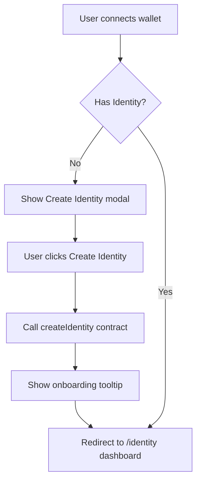
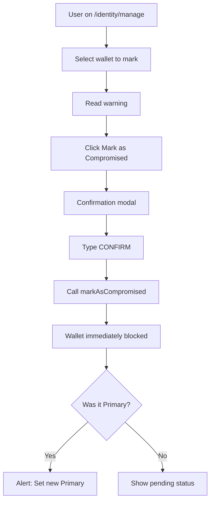
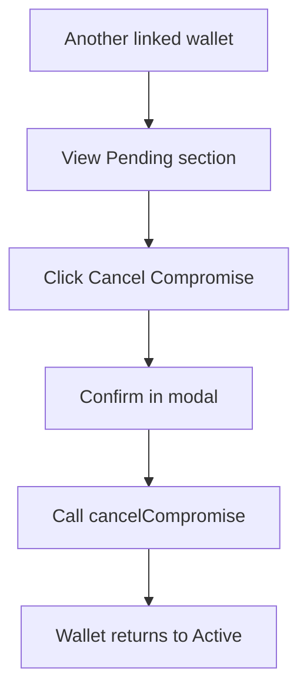
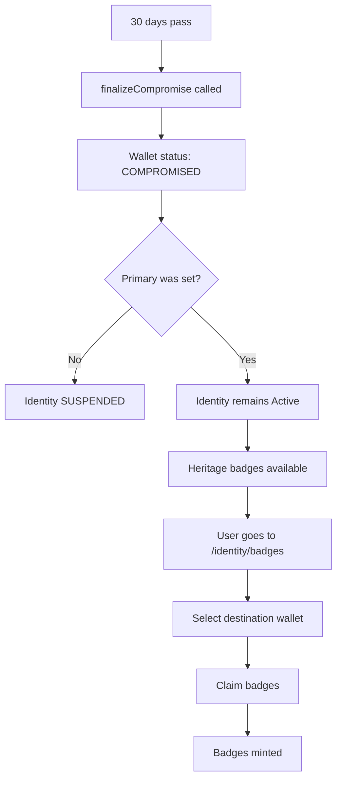
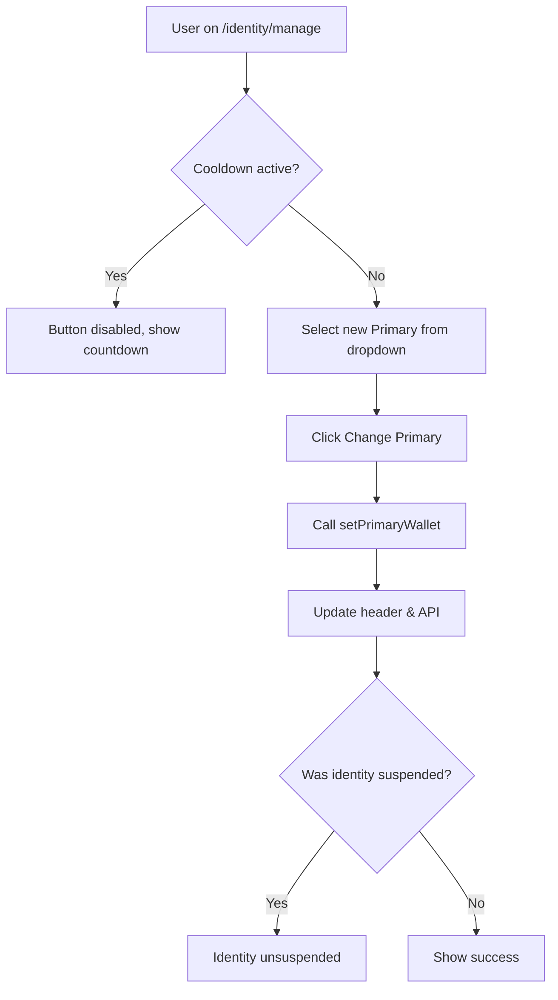

# SURGE Identity System — UI/UX Specification

> **Document Purpose:** Complete UI/UX specification for the SURGE Identity Dashboard. For designers (Figma) and developers (frontend implementation).

---

## Table of Contents

1. [Information Architecture](#1-information-architecture)
2. [Identity Dashboard](#2-identity-dashboard-identity)
3. [Wallet Linking Flow](#3-wallet-linking-flow-identitylink)
4. [Manage Wallets](#4-manage-wallets-identitymanage)
5. [Heritage Badges](#5-heritage-badges-identitybadges)
6. [Public Verification](#6-public-verification-verifywallet)
7. [Visual Design System](#7-visual-design-system)
8. [User Flows](#8-user-flows)
9. [Copy & UX Guidelines](#9-copy--ux-guidelines)
10. [Responsive Design](#10-responsive-design)

---

## 1. Information Architecture

### 1.1 Site Map

```text
SURGE me UP
├── / (Home)
├── /create (Badge Generator)
├── /gallery (Badge Gallery)
├── /identity ← NEW
│   ├── /identity/link
│   ├── /identity/manage
│   ├── /identity/badges
│   └── /identity/recover (placeholder)
├── /verify/{wallet} ← NEW
└── /about
```

### 1.2 Navigation Updates

**Main Navigation Bar:**

```text
┌─────────────────────────────────────────────────────────────────────┐
│ [SURGE Logo]  [Home] [Create] [Gallery] [Identity] [About]  [👤 Connect] │
└─────────────────────────────────────────────────────────────────────┘
```

**Identity** link appears between Gallery and About.

### 1.3 Wallet Dropdown (Connected State)

When wallet is connected, show extended dropdown:

```text
┌─────────────────────────────┐
│ 0xABC...1234               │
│ ─────────────────────────── │
│ Identity #12345            │
│ Score: 847 ⭐ (Primary)     │
│ ─────────────────────────── │
│ [View Identity Dashboard]   │
│ [Manage Wallets]            │
│ ─────────────────────────── │
│ [Disconnect]                │
└─────────────────────────────┘
```

If connected wallet is **NOT primary**, show:

```text
│ Score: 435 (Individual)     │
│ Total Score on Primary →    │
```

---

## 2. Identity Dashboard (`/identity`)

### 2.1 Page Layout

```text
┌─────────────────────────────────────────────────────────────────────┐
│                        IDENTITY HEADER                               │
│  ┌─────────────────────────────────────────────────────────────┐    │
│  │ Identity #12345                              [Active ●]     │    │
│  │                                                             │    │
│  │        ╭──────────────╮                                    │    │
│  │        │     847      │  Total Identity Score              │    │
│  │        │    points    │  ═══════════════════               │    │
│  │        ╰──────────────╯  Experience: 320                   │    │
│  │                          Diversity: 280                     │    │
│  │                          Activity: 247                      │    │
│  └─────────────────────────────────────────────────────────────┘    │
├─────────────────────────────────────────────────────────────────────┤
│                         ALERT BANNER (if any)                        │
│  ┌─────────────────────────────────────────────────────────────┐    │
│  │ ⚠️ ACTION REQUIRED: Primary wallet pending compromise.       │    │
│  │    23 days remaining to set new Primary or identity         │    │
│  │    will be suspended.                    [Set New Primary]  │    │
│  └─────────────────────────────────────────────────────────────┘    │
├─────────────────────────────────────────────────────────────────────┤
│                       LINKED WALLETS                                 │
│                                                                      │
│  ┌─────────────────┐  ┌─────────────────┐  ┌─────────────────┐     │
│  │ 0xAAA...1111    │  │ 0xBBB...2222    │  │ 0xCCC...3333    │     │
│  │ [PRIMARY ⭐]     │  │ [Active ●]      │  │ [Compromised 🚫]│     │
│  │                 │  │                 │  │                 │     │
│  │ Score: 420      │  │ Score: 312      │  │ Score: 115      │     │
│  │ Since: Jan 2023 │  │ Since: Mar 2024 │  │ Blocked         │     │
│  │                 │  │                 │  │                 │     │
│  │ [Manage]        │  │ [Set Primary]   │  │ [Claim Badges]  │     │
│  └─────────────────┘  └─────────────────┘  └─────────────────┘     │
│                                                                      │
├─────────────────────────────────────────────────────────────────────┤
│                       QUICK ACTIONS                                  │
│                                                                      │
│  [+ Link New Wallet]    [⚙️ Manage Wallets]    [🎖️ Heritage Badges]   │
│                                                                      │
└─────────────────────────────────────────────────────────────────────┘
```

### 2.2 Header States

**State: Primary Wallet Connected**

```text
Identity #12345                              [Active ●]

       ╭──────────────╮
       │     847      │  Total Identity Score
       │    points    │
       ╰──────────────╯
```

**State: Non-Primary Wallet Connected**

```text
Identity #12345                              [Active ●]

       ╭──────────────╮
       │     312      │  Your Wallet Score
       │    points    │
       ╰──────────────╯
       
       Total Identity Score (847) visible on Primary: 0xAAA...1111
```

**State: Identity Suspended**

```text
Identity #12345                              [Suspended ◐]

       ╭──────────────╮
       │   LOCKED     │  Identity Suspended
       │              │  Select new Primary to reactivate
       ╰──────────────╯
```

### 2.3 Wallet Card Component

```text
┌─────────────────────────────┐
│ 0xAAA...1111                │ ← Address (monospace)
│ [PRIMARY ⭐]                 │ ← Status badge
│                             │
│ Individual Score            │
│ ████████████░░░ 420 pts     │ ← Progress bar
│                             │
│ Linked: January 15, 2023    │ ← Date
│                             │
│ [Manage] [Set as Primary]   │ ← Actions
└─────────────────────────────┘
```

**Card Status Variants:**

| Status | Badge Color | Background |
|--------|-------------|------------|
| Primary + Active | Blue/Indigo | Light blue tint |
| Active | Green | Default |
| Pending Compromise | Amber/Orange | Light orange tint |
| Compromised | Red | Light red tint |

### 2.4 No Identity State

When connected wallet has no identity:

```text
┌─────────────────────────────────────────────────────────────────────┐
│                                                                      │
│                        🆔                                            │
│                                                                      │
│               Create Your SURGE Identity                             │
│                                                                      │
│    Link multiple wallets, protect your reputation, and              │
│    preserve your on-chain history across the Superchain.            │
│                                                                      │
│                    [Create Identity]                                 │
│                                                                      │
│              Already have an identity?                               │
│              [Link This Wallet]                                      │
│                                                                      │
└─────────────────────────────────────────────────────────────────────┘
```

---

## 3. Wallet Linking Flow (`/identity/link`)

### 3.1 Step 1: Introduction

```text
┌─────────────────────────────────────────────────────────────────────┐
│                                                                      │
│                    Link a Wallet to Your Identity                    │
│                                                                      │
│  ┌─────────────────────────────────────────────────────────────┐    │
│  │                                                             │    │
│  │  🔗 What linking does:                                      │    │
│  │                                                             │    │
│  │  ✓ Aggregates all your on-chain history                    │    │
│  │  ✓ Enables recovery if a wallet is compromised             │    │
│  │  ✓ Combines scores from all linked wallets                 │    │
│  │                                                             │    │
│  │  ⚠️ Important:                                               │    │
│  │                                                             │    │
│  │  • This action is permanent — wallets cannot be unlinked   │    │
│  │  • Each wallet can only belong to ONE identity             │    │
│  │  • Both wallets must sign to confirm the link              │    │
│  │                                                             │    │
│  └─────────────────────────────────────────────────────────────┘    │
│                                                                      │
│                    [Start Linking Process]                           │
│                                                                      │
│                    [← Back to Dashboard]                             │
│                                                                      │
└─────────────────────────────────────────────────────────────────────┘
```

### 3.2 Step 2: Dual Signature

```text
┌─────────────────────────────────────────────────────────────────────┐
│                                                                      │
│                    Verify Wallet Ownership                           │
│                                                                      │
│           Identity: #12345                                           │
│                                                                      │
│  ┌─────────────────────────────────────────────────────────────┐    │
│  │                                                             │    │
│  │  STEP 1: Existing Wallet                                    │    │
│  │  ─────────────────────────────────                          │    │
│  │  0xAAA...1111 (currently connected)                         │    │
│  │                                                             │    │
│  │  [✓ Signature Received]                                     │    │
│  │                                                             │    │
│  └─────────────────────────────────────────────────────────────┘    │
│                                                                      │
│                           ↓                                          │
│                                                                      │
│  ┌─────────────────────────────────────────────────────────────┐    │
│  │                                                             │    │
│  │  STEP 2: New Wallet                                         │    │
│  │  ─────────────────────────────────                          │    │
│  │  Connect the wallet you want to link                        │    │
│  │                                                             │    │
│  │  [Connect New Wallet]                                        │    │
│  │                                                             │    │
│  │  or paste address for WalletConnect:                        │    │
│  │  ┌─────────────────────────────────────────────────────┐   │    │
│  │  │ 0x...                                               │   │    │
│  │  └─────────────────────────────────────────────────────┘   │    │
│  │                                                             │    │
│  └─────────────────────────────────────────────────────────────┘    │
│                                                                      │
│  ℹ️ Both wallets must sign to confirm this permanent link.           │
│                                                                      │
│                    [Cancel]                                          │
│                                                                      │
└─────────────────────────────────────────────────────────────────────┘
```

### 3.3 Step 2b: Second Signature

After new wallet connected:

```text
│  STEP 2: New Wallet                                         │
│  ─────────────────────────────────                          │
│  0xBBB...2222 (connected)                                   │
│                                                             │
│  [Sign Message to Confirm Link]                             │
```

### 3.4 Step 3: Confirmation

```text
┌─────────────────────────────────────────────────────────────────────┐
│                                                                      │
│                         ✓ Wallet Linked!                             │
│                                                                      │
│  ┌─────────────────────────────────────────────────────────────┐    │
│  │                                                             │    │
│  │  0xBBB...2222 is now linked to Identity #12345              │    │
│  │                                                             │    │
│  │  ┌─────────────────────────────────────────────────────┐   │    │
│  │  │ Your Identity Score                                 │   │    │
│  │  │                                                     │   │    │
│  │  │ Before: 420 pts                                     │   │    │
│  │  │ After:  732 pts  (+312)                             │   │    │
│  │  └─────────────────────────────────────────────────────┘   │    │
│  │                                                             │    │
│  └─────────────────────────────────────────────────────────────┘    │
│                                                                      │
│          [Back to Dashboard]    [Link Another Wallet]                │
│                                                                      │
└─────────────────────────────────────────────────────────────────────┘
```

---

## 4. Manage Wallets (`/identity/manage`)

### 4.1 Page Layout

```text
┌─────────────────────────────────────────────────────────────────────┐
│                                                                      │
│                    Manage Identity Wallets                           │
│                    Identity #12345                                   │
│                                                                      │
├─────────────────────────────────────────────────────────────────────┤
│                                                                      │
│  ┌─────────────────────────────────────────────────────────────┐    │
│  │ PRIMARY WALLET                                               │    │
│  │ ─────────────────────────────────────────────────────────── │    │
│  │                                                             │    │
│  │ Current Primary: 0xAAA...1111  [PRIMARY ⭐]                  │    │
│  │                                                             │    │
│  │ • Receives rewards & airdrops                               │    │
│  │ • Exposes aggregated Identity Score                         │    │
│  │ • Used for external verification                            │    │
│  │                                                             │    │
│  │ ─────────────────────────────────────────────────────────── │    │
│  │                                                             │    │
│  │ Change Primary Wallet:                                      │    │
│  │                                                             │    │
│  │ ┌───────────────────────────────────────────┐              │    │
│  │ │ Select wallet...                       ▼ │              │    │
│  │ └───────────────────────────────────────────┘              │    │
│  │                                                             │    │
│  │ Cooldown: 12 days remaining                                 │    │
│  │ [Change Primary] (disabled)                                 │    │
│  │                                                             │    │
│  └─────────────────────────────────────────────────────────────┘    │
│                                                                      │
├─────────────────────────────────────────────────────────────────────┤
│                                                                      │
│  ┌─────────────────────────────────────────────────────────────┐    │
│  │ MARK WALLET AS COMPROMISED                                   │    │
│  │ ─────────────────────────────────────────────────────────── │    │
│  │                                                             │    │
│  │ If a wallet is hacked or unsafe, you can mark it as        │    │
│  │ compromised. This will immediately:                         │    │
│  │                                                             │    │
│  │ • Block this wallet from using SURGE                        │    │
│  │ • Stop counting new activity from this wallet               │    │
│  │ • Remove it as Primary (if it was)                          │    │
│  │ • Start 30-day dispute period                               │    │
│  │                                                             │    │
│  │ ⚠️ History BEFORE marking will be preserved.                 │    │
│  │ ⚠️ Action becomes irreversible after 30 days.                │    │
│  │                                                             │    │
│  │ Select wallet to mark:                                      │    │
│  │ ┌───────────────────────────────────────────┐              │    │
│  │ │ 0xBBB...2222 (Active)                  ▼ │              │    │
│  │ └───────────────────────────────────────────┘              │    │
│  │                                                             │    │
│  │ [🚫 Mark as Compromised]                                     │    │
│  │                                                             │    │
│  └─────────────────────────────────────────────────────────────┘    │
│                                                                      │
├─────────────────────────────────────────────────────────────────────┤
│                                                                      │
│  ┌─────────────────────────────────────────────────────────────┐    │
│  │ PENDING COMPROMISE                                           │    │
│  │ ─────────────────────────────────────────────────────────── │    │
│  │                                                             │    │
│  │ ┌─────────────────────────────────────────────────────┐    │    │
│  │ │ 0xCCC...3333                       [Pending ◐]      │    │    │
│  │ │                                                     │    │    │
│  │ │ Marked: December 10, 2025                           │    │    │
│  │ │ Finalizes: January 9, 2026 (29 days left)           │    │    │
│  │ │                                                     │    │    │
│  │ │ Status: BLOCKED (cannot login or use platform)      │    │    │
│  │ │                                                     │    │    │
│  │ │ [Cancel Compromise]                                 │    │    │
│  │ └─────────────────────────────────────────────────────┘    │    │
│  │                                                             │    │
│  │ No pending compromises? Section hidden.                     │    │
│  │                                                             │    │
│  └─────────────────────────────────────────────────────────────┘    │
│                                                                      │
└─────────────────────────────────────────────────────────────────────┘
```

### 4.2 Suspended Identity State

When identity is suspended, show prominent banner at top:

```text
┌─────────────────────────────────────────────────────────────────────┐
│ 🔒 IDENTITY SUSPENDED                                                │
│                                                                      │
│ Your identity is suspended because:                                  │
│ • A compromised wallet was finalized                                 │
│ • No Primary wallet was set                                          │
│                                                                      │
│ To reactivate your identity:                                         │
│ 1. Select a new Primary wallet from your linked wallets              │
│ 2. Confirm the change                                                │
│                                                                      │
│ [Select Primary & Reactivate]                                        │
└─────────────────────────────────────────────────────────────────────┘
```

### 4.3 Confirmation Modals

**Mark as Compromised Modal:**

```text
┌─────────────────────────────────────────────────────────────────────┐
│                                                                      │
│               ⚠️ Confirm Mark as Compromised                         │
│                                                                      │
│  You are about to mark 0xBBB...2222 as compromised.                  │
│                                                                      │
│  This will:                                                          │
│  ✓ Immediately block this wallet                                     │
│  ✓ Start 30-day dispute period                                       │
│  ✓ Preserve history up to this moment                                │
│                                                                      │
│  After 30 days:                                                      │
│  • This action becomes permanent                                     │
│  • Heritage badges can be claimed                                    │
│                                                                      │
│  Type "CONFIRM" to proceed:                                          │
│  ┌────────────────────────────────────────────┐                     │
│  │                                            │                     │
│  └────────────────────────────────────────────┘                     │
│                                                                      │
│              [Cancel]    [Mark as Compromised]                       │
│                                                                      │
└─────────────────────────────────────────────────────────────────────┘
```

---

## 5. Heritage Badges (`/identity/badges`)

### 5.1 Page Layout

```text
┌─────────────────────────────────────────────────────────────────────┐
│                                                                      │
│                    🎖️ Heritage Badges                                 │
│                                                                      │
│  Heritage badges prove your historical on-chain experience from      │
│  compromised wallets. They are minted to your active wallets and    │
│  help show veteran status and expertise.                             │
│                                                                      │
├─────────────────────────────────────────────────────────────────────┤
│                                                                      │
│  AVAILABLE TO CLAIM                                                  │
│  ─────────────────────────────────────────────────────────────────  │
│                                                                      │
│  From compromised wallet: 0xCCC...3333                               │
│                                                                      │
│  ┌───────────────────┐  ┌───────────────────┐  ┌───────────────────┐│
│  │ 🏅                │  │ 🎯                │  │ 🌐                ││
│  │ Veteran Wallet    │  │ Contract Maestro  │  │ Cross-Chain Native││
│  │                   │  │                   │  │                   ││
│  │ 3 years 4 months  │  │ 5,247 unique      │  │ Active on 6       ││
│  │ of activity       │  │ interactions      │  │ networks          ││
│  │                   │  │                   │  │                   ││
│  │ [Claim Badge]     │  │ [Claim Badge]     │  │ [Claim Badge]     ││
│  └───────────────────┘  └───────────────────┘  └───────────────────┘│
│                                                                      │
│  Destination wallet:                                                 │
│  ┌───────────────────────────────────────────────────────────┐      │
│  │ 0xAAA...1111 (Primary)                                  ▼ │      │
│  └───────────────────────────────────────────────────────────┘      │
│                                                                      │
│                    [Claim All Available Badges]                      │
│                                                                      │
├─────────────────────────────────────────────────────────────────────┤
│                                                                      │
│  ALREADY CLAIMED                                                     │
│  ─────────────────────────────────────────────────────────────────  │
│                                                                      │
│  ┌───────────────────┐  ┌───────────────────┐                       │
│  │ 🎖️                 │  │ 💎                │                       │
│  │ Volume Warrior    │  │ Event Collector   │                       │
│  │                   │  │                   │                       │
│  │ 15.2 ETH volume   │  │ 42 SURGE badges   │                       │
│  │                   │  │                   │                       │
│  │ From: 0xDDD...4444│  │ From: 0xDDD...4444│                       │
│  │ Claimed: Dec 2025 │  │ Claimed: Dec 2025 │                       │
│  └───────────────────┘  └───────────────────┘                       │
│                                                                      │
└─────────────────────────────────────────────────────────────────────┘
```

### 5.2 Badge Card Component

```text
┌─────────────────────────────┐
│         🏅                   │  ← Icon/illustration
│                             │
│    Veteran Wallet           │  ← Badge title
│                             │
│    3 years 4 months         │  ← Achievement description
│    of activity              │
│                             │
│ ─────────────────────────── │
│ Status: Available           │
│ From: 0xCCC...3333          │
│                             │
│    [Claim Badge]            │
└─────────────────────────────┘
```

### 5.3 Badge Types

| Badge | Icon | Description | Criteria |
|-------|------|-------------|----------|
| Veteran Wallet | 🏅 | Long-standing Web3 presence | Wallet age > 1 year |
| Volume Warrior | 🎖️ | High transaction volume | > 10 ETH total volume |
| Cross-Chain Native | 🌐 | Multi-chain explorer | Activity on 3+ networks |
| Contract Maestro | 🎯 | Protocol diversity | 50+ unique contracts |
| Event Collector | 💎 | Community participant | 20+ SURGE badges |

---

## 6. Public Verification (`/verify/{wallet}`)

### 6.1 Has Identity — Primary Wallet

```text
┌─────────────────────────────────────────────────────────────────────┐
│                                                                      │
│              SURGE Identity Verification                             │
│                                                                      │
│  ─────────────────────────────────────────────────────────────────  │
│                                                                      │
│  Wallet: 0xAAA...1111                                                │
│                                                                      │
│  ┌─────────────────────────────────────────────────────────────┐    │
│  │                                                             │    │
│  │  ✓ Linked to SURGE Identity #12345                         │    │
│  │                                                             │    │
│  │  Status: Active                                             │    │
│  │  Role: PRIMARY ⭐                                            │    │
│  │                                                             │    │
│  │  ════════════════════════════════════════════               │    │
│  │                                                             │    │
│  │  Total Identity Score: 847                                  │    │
│  │  Linked Wallets: 3                                          │    │
│  │  Member Since: January 2023                                 │    │
│  │                                                             │    │
│  └─────────────────────────────────────────────────────────────┘    │
│                                                                      │
│  ─────────────────────────────────────────────────────────────────  │
│                                                                      │
│  Heritage Badges:                                                    │
│                                                                      │
│  [🏅 Veteran Wallet] [🎯 Contract Maestro] [🌐 Cross-Chain Native]   │
│                                                                      │
│  ─────────────────────────────────────────────────────────────────  │
│                                                                      │
│  [View on Block Explorer]    [Share Verification]                    │
│                                                                      │
└─────────────────────────────────────────────────────────────────────┘
```

### 6.2 Has Identity — Non-Primary Wallet

```text
│  ✓ Linked to SURGE Identity #12345                         │
│                                                             │
│  Status: Active                                             │
│  Role: Linked (not primary)                                 │
│                                                             │
│  ════════════════════════════════════════════               │
│                                                             │
│  Individual Score: 312                                      │
│                                                             │
│  ℹ️ This wallet is linked but NOT primary.                   │
│     External reputation checks should query                 │
│     the primary wallet: 0xAAA...1111                        │
```

### 6.3 Compromised Wallet

```text
│  ⚠️ Linked to SURGE Identity #12345                         │
│                                                             │
│  Status: COMPROMISED 🚫                                      │
│                                                             │
│  ════════════════════════════════════════════               │
│                                                             │
│  This wallet has been marked as compromised.                │
│  Do NOT use for authentication or rewards.                  │
│                                                             │
│  Identity must be validated via an active                   │
│  primary wallet: 0xAAA...1111                               │
```

### 6.4 No Identity

```text
┌─────────────────────────────────────────────────────────────────────┐
│                                                                      │
│              SURGE Identity Verification                             │
│                                                                      │
│  ─────────────────────────────────────────────────────────────────  │
│                                                                      │
│  Wallet: 0xXXX...9999                                                │
│                                                                      │
│  ┌─────────────────────────────────────────────────────────────┐    │
│  │                                                             │    │
│  │  ✗ No SURGE Identity Found                                  │    │
│  │                                                             │    │
│  │  This wallet is not linked to any SURGE Identity.          │    │
│  │                                                             │    │
│  │  [Create Identity →]                                        │    │
│  │                                                             │    │
│  └─────────────────────────────────────────────────────────────┘    │
│                                                                      │
└─────────────────────────────────────────────────────────────────────┘
```

---

## 7. Visual Design System

### 7.1 Color Palette

```text
┌─────────────────────────────────────────────────────────────────────┐
│ DESIGN TOKENS                                                        │
├─────────────────────────────────────────────────────────────────────┤
│                                                                      │
│ PRIMARY          #4F46E5  Indigo     ████████                       │
│ PRIMARY_HOVER    #4338CA  Indigo 700 ████████                       │
│                                                                      │
│ BACKGROUND       #F8FAFC  Slate 50   ████████                       │
│ SURFACE          #FFFFFF  White      ████████                       │
│ BORDER           #E2E8F0  Slate 200  ████████                       │
│                                                                      │
│ TEXT_PRIMARY     #0F172A  Slate 900  ████████                       │
│ TEXT_SECONDARY   #64748B  Slate 500  ████████                       │
│ TEXT_MUTED       #94A3B8  Slate 400  ████████                       │
│                                                                      │
│ SUCCESS          #10B981  Emerald    ████████  (Active)             │
│ WARNING          #F59E0B  Amber      ████████  (Pending)            │
│ DANGER           #EF4444  Red        ████████  (Compromised)        │
│ SUSPENDED        #6B7280  Gray       ████████  (Suspended)          │
│                                                                      │
└─────────────────────────────────────────────────────────────────────┘
```

### 7.2 Status Chips

```text
[Active ●]        → Green pill, white text
[PRIMARY ⭐]       → Indigo pill, white text  
[Pending ◐]       → Amber pill, dark text
[Compromised 🚫]  → Red pill, white text
[Suspended ◐]     → Gray pill, white text
```

CSS:

```css
.status-chip {
  display: inline-flex;
  align-items: center;
  padding: 4px 12px;
  border-radius: 9999px;
  font-size: 12px;
  font-weight: 500;
  gap: 6px;
}

.status-active { background: #10B981; color: white; }
.status-primary { background: #4F46E5; color: white; }
.status-pending { background: #FEF3C7; color: #92400E; }
.status-compromised { background: #EF4444; color: white; }
.status-suspended { background: #6B7280; color: white; }
```

### 7.3 Buttons

```text
PRIMARY BUTTON
┌─────────────────────────┐
│    Create Identity      │  Background: #4F46E5
└─────────────────────────┘  Text: white

SECONDARY BUTTON
┌─────────────────────────┐
│    Manage Wallets       │  Border: #E2E8F0
└─────────────────────────┘  Background: white, Text: #0F172A

DESTRUCTIVE BUTTON
┌─────────────────────────┐
│  Mark as Compromised    │  Background: #EF4444
└─────────────────────────┘  Text: white
```

### 7.4 Alert Banners

```text
INFO BANNER
┌─────────────────────────────────────────────────────────────────────┐
│ ℹ️  Your wallet score contributes to the total Identity score.       │
└─────────────────────────────────────────────────────────────────────┘
Background: #EFF6FF (Blue 50), Border-left: #3B82F6

WARNING BANNER
┌─────────────────────────────────────────────────────────────────────┐
│ ⚠️  Primary wallet pending compromise. 23 days to set new Primary.  │
└─────────────────────────────────────────────────────────────────────┘
Background: #FFFBEB (Amber 50), Border-left: #F59E0B

DANGER BANNER
┌─────────────────────────────────────────────────────────────────────┐
│ 🚨 Identity suspended. Select new Primary to reactivate.            │
└─────────────────────────────────────────────────────────────────────┘
Background: #FEF2F2 (Red 50), Border-left: #EF4444
```

### 7.5 Typography

| Element | Font | Size | Weight |
|---------|------|------|--------|
| Page Title | Inter/Poppins | 32px | 600 |
| Section Title | Inter/Poppins | 24px | 600 |
| Card Title | Inter | 18px | 500 |
| Body Text | Inter | 16px | 400 |
| Small/Caption | Inter | 14px | 400 |
| Monospace (addresses) | JetBrains Mono | 14px | 400 |

---

## 8. User Flows

### 8.1 First-Time Identity Creation



### 8.2 Linking Second Wallet

```mermaid
flowchart TD
    A[User on /identity] --> B[Click Link New Wallet]
    B --> C[/identity/link intro screen]
    C --> D[Click Start Linking]
    D --> E[Sign from existing wallet]
    E --> F[Connect new wallet]
    F --> G[Sign from new wallet]
    G --> H[Call linkWallet contract]
    H --> I[Show confirmation + new score]
    I --> J[Back to dashboard]
```

### 8.3 Mark as Compromised Flow



### 8.4 Cancel Compromise Flow



### 8.5 Finalize Compromise & Claim Badges



### 8.6 Change Primary Wallet



---

## 9. Copy & UX Guidelines

### 9.1 Tone of Voice

- **Calm and security-aware** — not alarmist
- **Clear and direct** — explain consequences before actions
- **Non-technical for users** — jargon in tooltips

### 9.2 Key Copy Examples

**Identity Dashboard Header:**

```text
"Your SURGE Identity Score represents your aggregated on-chain 
reputation across all linked wallets."
```

**Wallet Linking Warning:**

```text
"This action is permanent. Once linked, a wallet cannot be 
unlinked or transferred to another identity."
```

**Compromise Warning:**

```text
"Marking a wallet as compromised will immediately block it from 
all SURGE functions. You have 30 days to cancel if this was a mistake."
```

**Suspended Identity:**

```text
"Your identity is temporarily locked because no Primary wallet is set. 
Select a new Primary to continue using SURGE."
```

**Heritage Badges Intro:**

```text
"Heritage badges honor your on-chain journey. They prove your 
experience survives even when wallets don't."
```

### 9.3 Button Copy

| Action | Copy | Type |
|--------|------|------|
| Create identity | "Create Identity" | Primary |
| Link wallet | "Link New Wallet" | Primary |
| Start linking | "Start Linking Process" | Primary |
| Sign message | "Sign Message to Confirm" | Primary |
| Change primary | "Change Primary" | Secondary |
| Mark compromised | "Mark as Compromised" | Destructive |
| Cancel compromise | "Cancel Compromise" | Secondary |
| Claim badge | "Claim Badge" | Primary |
| View dashboard | "Back to Dashboard" | Secondary |

### 9.4 Error Messages

```text
"Wallet already linked to another identity. Each wallet can only 
belong to one SURGE Identity."

"Cannot mark your currently connected wallet as compromised. 
Connect a different linked wallet first."

"Cooldown active. You can change Primary wallet in X days."

"Transaction failed. Please try again or check your wallet balance."
```

### 9.5 Tooltips

**Primary Badge Tooltip:**

```text
"Primary wallet receives all rewards, airdrops, and exposes the 
total Identity Score for external verification."
```

**Individual Score Tooltip:**

```text
"This wallet's individual contribution to your total Identity Score. 
Only the Primary wallet shows the aggregated score externally."
```

**Dispute Period Tooltip:**

```text
"30-day window where you can cancel a compromise marking from 
another linked wallet. After this period, the action is permanent."
```

---

## 10. Responsive Design

### 10.1 Breakpoints

| Breakpoint | Width | Layout |
|------------|-------|--------|
| Mobile | < 640px | Single column, stacked cards |
| Tablet | 640px - 1024px | 2-column grid |
| Desktop | > 1024px | 3-column grid, side panels |

### 10.2 Mobile Adaptations

**Dashboard:**

- Score card full width
- Wallet cards stacked vertically
- Quick actions as horizontal scroll or bottom bar

**Manage Page:**

- Accordion sections instead of side-by-side
- Full-width dropdowns
- Sticky action buttons at bottom

**Wallet Cards (Mobile):**

```text
┌─────────────────────────────┐
│ 0xAAA...1111  [PRIMARY ⭐]   │
│ Score: 420 pts              │
│ Linked: Jan 2023            │
│ [Manage] [Set Primary]      │
└─────────────────────────────┘
```

### 10.3 Touch Targets

- Minimum button height: 44px
- Minimum tap target: 48x48px
- Spacing between interactive elements: 8px minimum

---

## References

- [RFC-001-SURGE-Identity.md](../rfc/RFC-001-SURGE-Identity.md)
- [RFC-001-Technical-Spec.md](../rfc/RFC-001-Technical-Spec.md)
- Design inspiration: Linear, Vercel, Rainbow, Uniswap

---

*UI/UX Specification v1.0 — SURGE Core Team — 2025-12-11*
