# RFC-001: SURGE Identity System

## Multi-Wallet Identity & Reputation Preservation for the Superchain

| Field | Value |
|-------|-------|
| **RFC Number** | 001 |
| **Title** | SURGE Identity System |
| **Author** | SURGE Core Team |
| **Status** | Draft |
| **Created** | 2025-12-11 |
| **Target Networks** | Base, Optimism, Celo, Zora, Ink, Lisk, Unichain, Soneium |

---

## Summary

The **SURGE Identity System** introduces a multi-wallet identity layer for the Optimism Superchain, enabling users to:

1. **Link multiple wallets** to a single on-chain identity
2. **Protect against wallet compromise** with a secure recovery flow
3. **Preserve reputation** by transferring activity history to new wallets via Heritage Badges
4. **Designate a Primary wallet** for external eligibility checks (airdrops, gating, voting)

This RFC defines the architecture, data structures, and smart contracts required to implement identity management as a foundational layer beneath the existing SURGE badge ecosystem.

---

## Motivation

### The Problem: Wallet-Based Identity is Brittle

In Web3, your wallet address IS your identity. This creates critical vulnerabilities:

- **Key Loss/Compromise** → Total loss of on-chain reputation, airdrops, DAO voting rights
- **No Recovery Path** → Unlike Web2 passwords, there's no "forgot my key" option
- **Fragmented History** → Activity across chains creates multiple "identities" by accident

**Real-World Example:**
> A user with 3+ years of DeFi history, 200+ POAP badges, and significant DAO contributions has their hot wallet compromised. They lose EVERYTHING — not just assets, but their entire verifiable on-chain history.

### Why Existing Solutions Fall Short

| Solution | Limitation |
|----------|------------|
| **ENS** | Tied to a single address. If wallet is compromised, ENS provides no recovery. |
| **POAP** | Proof of attendance only. No identity continuity or cross-wallet aggregation. |
| **SBTs (Soulbound Tokens)** | Bound to address, not identity. Compromise = permanent loss. |
| **Social Recovery Wallets** | Protect assets, not reputation/history. Limited adoption. |

### Why SURGE Identity?

SURGE takes a different approach:

1. **Identity ≠ Address** — Your identity persists even if individual wallets are compromised
2. **History Preservation** — Activity from compromised wallets is preserved, not lost
3. **Aggregated Reputation** — Cross-chain activity unified under one identity
4. **Heritage Badges** — Claim recognition for past achievements on new wallets

---

## User Stories

### Story 1: The Compromised Whale
>
> **Alice** is a DeFi power user with 3 years of on-chain history. Her primary wallet is compromised via a phishing attack. With SURGE Identity, she immediately marks the wallet as compromised from her backup wallet. Her reputation score and badge history are preserved. She claims Heritage Badges to her new primary wallet and continues participating in airdrops and DAO votes.

### Story 2: The Airdrop Hunter Defense
>
> **A protocol** wants to distribute tokens to "real veterans" across the Superchain, not farmers with 100 wallets. They query the SURGE Identity API: only wallets marked as Primary with verified identities receive the full allocation. Sybil wallets with no linked identity get nothing.

### Story 3: The DAO Voter
>
> **Bob** participates in 5 DAOs across Base, Optimism, and Celo. Each DAO can query his SURGE Identity to see his aggregate reputation score across all chains, rather than just activity on their specific network.

### Story 4: The Multi-Wallet User
>
> **Carol** uses separate wallets for DeFi, NFTs, and DAO voting for security. She links all three to one SURGE Identity, designating her cold wallet as Primary. External queries see her combined activity score.

### Story 5: The New Chain Explorer
>
> **Dave** deploys to a new Superchain network. His existing identity automatically extends to the new chain — no need to "rebuild" his reputation from scratch.

---

## High-Level Architecture

### Core Concepts

```
┌─────────────────────────────────────────────────────────────┐
│                      SURGE IDENTITY                          │
│                                                              │
│   One Identity (identityId) ←→ Many Wallets                 │
│                                                              │
│   ┌─────────┐   ┌─────────┐   ┌─────────┐   ┌─────────┐    │
│   │Wallet A │   │Wallet B │   │Wallet C │   │Wallet D │    │
│   │ PRIMARY │   │ ACTIVE  │   │COMPROMISED│  │ ACTIVE  │    │
│   │   ⭐    │   │         │   │    🚫    │   │         │    │
│   └────┬────┘   └────┬────┘   └────┬────┘   └────┬────┘    │
│        │             │             │             │          │
│        └─────────────┴─────────────┴─────────────┘          │
│                           │                                  │
│              ┌────────────┴────────────┐                    │
│              │     IdentityAnchor      │                    │
│              │    Soulbound NFT (SBT)  │                    │
│              │    Same tokenId = 12345 │                    │
│              └─────────────────────────┘                    │
└─────────────────────────────────────────────────────────────┘
```

### Key Components

| Component | Description |
|-----------|-------------|
| **Identity** | A unique on-chain entity (identityId) representing a single user |
| **Linked Wallets** | Multiple addresses bound to one identity; cannot be unlinked |
| **IdentityAnchor (SBT)** | Soulbound NFT minted to each linked wallet with same tokenId |
| **Primary Wallet** | The currently active wallet for aggregated score display |
| **Wallet Status** | ACTIVE, PENDING_COMPROMISE, or COMPROMISED |
| **Heritage Badges** | Achievement badges claimable from compromised wallet history |

### Identity ↔ Wallets Relationship

```mermaid
graph LR
    subgraph Identity["🆔 Identity #12345"]
        direction TB
        A[Wallet A<br/>PRIMARY ⭐]
        B[Wallet B<br/>ACTIVE]
        C[Wallet C<br/>COMPROMISED 🚫]
    end
    
    subgraph SBTs["Soulbound Tokens"]
        SBT_A[SBT #12345<br/>→ Wallet A]
        SBT_B[SBT #12345<br/>→ Wallet B]
        SBT_C[SBT #12345<br/>→ Wallet C]
    end
    
    A --> SBT_A
    B --> SBT_B
    C --> SBT_C
    
    subgraph External["External Queries"]
        API["/api/identity/{wallet}"]
    end
    
    API -->|"aggregatedScore"| A
    API -->|"individualScore only"| B
    API -->|"blocked"| C
```



### Wallet Status State Machine


---

## Smart Contract Overview

Three new contracts compose the Identity Layer:

### 1. IdentityAnchor.sol

- **Purpose:** Soulbound ERC-721 token proving wallet membership in an identity
- **Key Feature:** All wallets in the same identity receive the same tokenId
- **Non-transferable:** Cannot be transferred or burned (true soulbound)

### 2. IdentityRegistry.sol

- **Purpose:** Core logic for identity management
- **Functions:** Create identity, link wallets, set primary, compromise flow
- **Integrates:** With existing SURGEReputation for score aggregation

### 3. HeritageBadges.sol

- **Purpose:** Mint achievement badges based on compromised wallet history
- **Categories:** Veteran Wallet, Volume Warrior, Cross-Chain Native, etc.
- **Claim:** Only to active wallets within the same identity

---

## Integration with Existing SURGE

The Identity Layer integrates with (not replaces) existing SURGE contracts:


---

## Deployment Strategy

### Phase 0: MVP (Single Chain)

- Deploy IdentityAnchor + IdentityRegistry + HeritageBadges on **Base only**
- Existing SURGE badge contracts continue on all 8 mainnet networks:
  - Base, Optimism, Celo, Zora, Ink, Lisk, Unichain, Soneium
- Off-chain indexer aggregates cross-chain badge data

### Phase 1: Multi-Chain Expansion

- Deploy identity contracts to all 7 remaining networks
- Backend indexer syncs identity state across chains
- No LayerZero dependency — Superchain-native approach

### Phase 2: Full Superchain

- All 8 mainnet networks fully covered
- Optional: Implement OP Stack native L2→L2 messaging for direct sync
- Backend sync remains as fallback

---

## Security Considerations

1. **Sybil Resistance:** Only Primary wallet exposes aggregated score
2. **30-Day Dispute Window:** Prevents malicious compromise marking
3. **Dual-Signature Linking:** Both wallets must sign to link
4. **No Unlinking:** Once linked, wallets cannot be unlinked (prevents identity theft)
5. **Suspension Mechanism:** Identity suspends if Primary is compromised and no new Primary is set

---

## Open Questions for Community

See [RFC-001-Voting-Questions.md](./RFC-001-Voting-Questions.md) for governance decisions:

1. Dispute period length (14/30/60 days)
2. Primary wallet cooldown (7/14/30 days)
3. Suspension vs auto-assign Primary behavior
4. Heritage badges claim mode
5. Stake requirements for recovery (future phase)

---

## References

- [RFC-001-Technical-Spec.md](./RFC-001-Technical-Spec.md) — Detailed implementation specification
- [RFC-001-FAQ.md](./RFC-001-FAQ.md) — Frequently asked questions
- [RFC-001-Voting-Questions.md](./RFC-001-Voting-Questions.md) — Community governance questions
- [SURGE_PROTOCOL.md](../SURGE_PROTOCOL.md) — Brand and mission overview

---

*RFC-001 Draft — SURGE Core Team — 2025-12-11*
