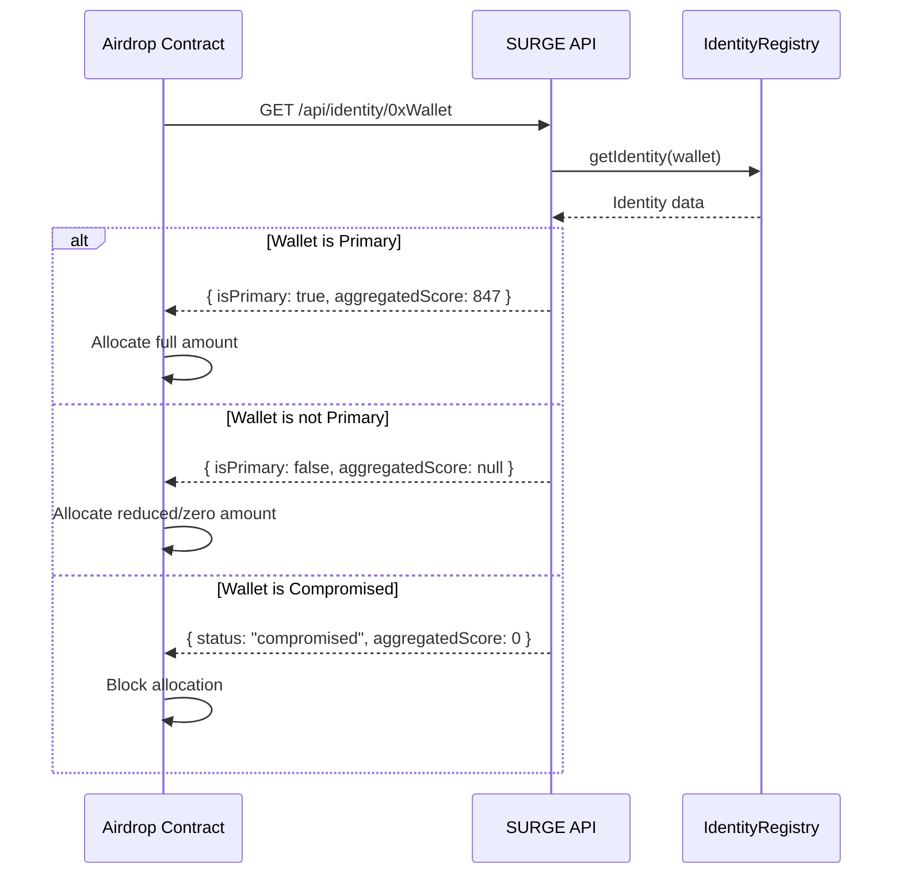
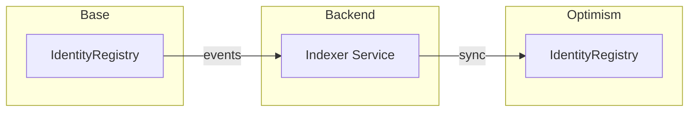

# RFC-001: Technical Specification

## SURGE Identity System — Contract-Level Implementation

| Field | Value |
|-------|-------|
| **Parent RFC** | RFC-001-SURGE-Identity |
| **Spec Version** | 1.0.0 |
| **Solidity Version** | ^0.8.20 |
| **Target Networks** | Base, Optimism, Celo, Zora, Ink, Lisk, Unichain, Soneium |

---

## Table of Contents

1. [Data Structures](#1-data-structures)
2. [IdentityAnchor.sol](#2-identityanchorsol)
3. [IdentityRegistry.sol](#3-identityregistrysol)
4. [HeritageBadges.sol](#4-heritagebadgessol)
5. [Wallet Status State Machine](#5-wallet-status-state-machine)
6. [Primary Wallet & Anti-Sybil](#6-primary-wallet--anti-sybil)
7. [Deployment & Networks](#7-deployment--networks)
8. [API Specification](#8-api-specification)

---

## 1. Data Structures

### 1.1 Identity Struct

```solidity
struct Identity {
    uint256 identityId;           // Unique identity identifier (same as SBT tokenId)
    address[] linkedWallets;      // All wallets linked to this identity
    address primaryWallet;        // Currently active primary wallet
    bool isSuspended;             // True if identity is suspended (no active primary)
    uint256 createdAt;            // Identity creation timestamp
    uint256 lastPrimaryChangeAt;  // Last time primary wallet was changed
}
```

### 1.2 WalletStatus Struct

```solidity
struct WalletStatus {
    bool isLinked;                  // True if wallet is linked to an identity
    bool isPendingCompromise;       // True if compromise initiated but not finalized
    bool isCompromised;             // True if wallet is permanently compromised
    uint256 linkedAt;               // Timestamp when wallet was linked
    uint256 compromiseInitiatedAt;  // When markAsCompromised() was called
    uint256 compromisedAt;          // When finalizeCompromise() was called
    uint256 activityCountsUntil;    // Freeze point for activity history
}
```

### 1.3 SBT Metadata Schema (Off-Chain JSON)

```json
{
    "tokenId": 12345,
    "identityId": 12345,
    "wallet": "0x1234...abcd",
    "status": "active",
    "linkedAt": 1702276800,
    "compromiseInitiatedAt": null,
    "compromisedAt": null,
    "isPrimary": true,
    "attributes": [
        {
            "trait_type": "Identity Status",
            "value": "Active"
        },
        {
            "trait_type": "Wallet Role",
            "value": "Primary"
        },
        {
            "trait_type": "Linked Wallets Count",
            "value": 3
        }
    ]
}
```

**Status Values:**

- `"active"` — Wallet is active and can perform actions
- `"pending_compromise"` — 30-day dispute window, wallet blocked
- `"compromised"` — Permanently blocked

---

## 2. IdentityAnchor.sol

### 2.1 Overview

ERC-721 Soulbound Token (SBT) contract. Each linked wallet receives an SBT with the **same tokenId** (equal to identityId).

### 2.2 Key Properties

| Property | Description |
|----------|-------------|
| **Non-transferable** | `_update()` overridden to revert on transfer |
| **Non-burnable** | No burn function exposed |
| **One per wallet** | Wallet cannot mint second IdentityAnchor |
| **Same tokenId** | All wallets in identity share tokenId (identityId) |

### 2.3 State Variables

```solidity
// Wallet → tokenId mapping
mapping(address => uint256) public walletToTokenId;

// tokenId → Identity metadata
mapping(uint256 => address[]) public tokenIdToWallets;

// Only IdentityRegistry can mint
address public identityRegistry;

// Token counter
uint256 private _nextTokenId;
```

### 2.4 Functions

#### `mint(address wallet, uint256 identityId)`

```solidity
function mint(address wallet, uint256 identityId) external onlyRegistry returns (uint256);
```

**Requirements:**

- Caller MUST be IdentityRegistry contract
- `wallet` MUST NOT have existing IdentityAnchor
- `identityId` MUST be valid (> 0)

**Effects:**

- Mints SBT to `wallet` with `tokenId = identityId`
- Updates `walletToTokenId[wallet] = identityId`
- Appends `wallet` to `tokenIdToWallets[identityId]`
- Emits `Transfer(address(0), wallet, identityId)`

#### `tokenURI(uint256 tokenId)`

```solidity
function tokenURI(uint256 tokenId) public view override returns (string memory);
```

Returns dynamic metadata URI based on wallet status and identity state.

#### `_update()` (Override)

```solidity
function _update(address to, uint256 tokenId, address auth) 
    internal virtual override returns (address);
```

**Soulbound Enforcement:**

- Reverts if `to != address(0)` and `from != address(0)` (no transfers)
- Allows mint (`from == address(0)`)
- Could allow burn in future if needed (`to == address(0)`)

---

## 3. IdentityRegistry.sol

### 3.1 Overview

Core logic contract managing identity lifecycle, wallet linking, and compromise flow.

### 3.2 State Variables

```solidity
// Identity storage
mapping(uint256 => Identity) public identities;
mapping(address => uint256) public walletToIdentity;
mapping(address => WalletStatus) public walletStatuses;

// Counter for identity IDs
uint256 public nextIdentityId;

// Contract references
IIdentityAnchor public identityAnchor;
ISURGEReputation public reputationContract;

// Constants
uint256 public constant DISPUTE_PERIOD = 30 days;
uint256 public constant PRIMARY_COOLDOWN = 14 days;
```

### 3.3 Functions

#### 3.3.1 `createIdentity(address initialWallet)`

```solidity
function createIdentity(address initialWallet) external returns (uint256 identityId);
```

**Requirements:**

- `initialWallet` MUST NOT have existing identity
- Caller MUST be `initialWallet` (or authorized)

**Effects:**

1. Increments `nextIdentityId`
2. Creates new `Identity` struct:
   - `identityId = nextIdentityId`
   - `linkedWallets = [initialWallet]`
   - `primaryWallet = initialWallet`
   - `isSuspended = false`
   - `createdAt = block.timestamp`
   - `lastPrimaryChangeAt = block.timestamp`
3. Creates `WalletStatus` for `initialWallet`:
   - `isLinked = true`
   - `linkedAt = block.timestamp`
4. Mints SBT via `identityAnchor.mint(initialWallet, identityId)`
5. Emits `IdentityCreated(identityId, initialWallet)`

**Returns:** `identityId`

---

#### 3.3.2 `linkWallet()`

```solidity
function linkWallet(
    uint256 identityId,
    address existingLinkedWallet,
    address newWallet,
    bytes calldata existingWalletSignature,
    bytes calldata newWalletSignature
) external;
```

**Requirements:**

1. `existingLinkedWallet` MUST be linked to `identityId`
2. `existingLinkedWallet` MUST NOT be compromised or pending_compromise
3. `newWallet` MUST NOT have any existing identity/SBT
4. Both signatures MUST be valid for message:

   ```
   keccak256(abi.encodePacked(
       "SURGE_LINK_WALLET",
       identityId,
       existingLinkedWallet,
       newWallet,
       block.chainid
   ))
   ```

**Effects:**

1. Adds `newWallet` to `identities[identityId].linkedWallets`
2. Creates `WalletStatus` for `newWallet`
3. Mints SBT with same `identityId` to `newWallet`
4. Emits `WalletLinked(identityId, newWallet, existingLinkedWallet)`

---

#### 3.3.3 `setPrimaryWallet()`

```solidity
function setPrimaryWallet(uint256 identityId, address newPrimary) external;
```

**Requirements:**

1. Caller MUST be a linked wallet of `identityId`
2. Caller MUST NOT be compromised or pending_compromise
3. `newPrimary` MUST be linked to `identityId`
4. `newPrimary` MUST NOT be pending_compromise or compromised
5. Cooldown: `block.timestamp >= lastPrimaryChangeAt + PRIMARY_COOLDOWN`

**Effects:**

1. Sets `identities[identityId].primaryWallet = newPrimary`
2. Sets `lastPrimaryChangeAt = block.timestamp`
3. If `isSuspended == true`, sets `isSuspended = false`
4. Emits `PrimaryWalletChanged(identityId, oldPrimary, newPrimary)`

---

#### 3.3.4 `markAsCompromised()`

```solidity
function markAsCompromised(uint256 identityId, address walletToMark) external;
```

**Requirements:**

1. Caller MUST be a linked wallet of `identityId`
2. Caller MUST NOT be `walletToMark` (cannot mark self)
3. Caller MUST NOT be compromised or pending_compromise
4. `walletToMark` MUST be linked to `identityId`
5. `walletToMark` MUST NOT already be compromised

**Effects:**

1. Sets `walletStatuses[walletToMark]`:
   - `isPendingCompromise = true`
   - `compromiseInitiatedAt = block.timestamp`
   - `activityCountsUntil = block.timestamp`
2. If `walletToMark == primaryWallet`:
   - Sets `primaryWallet = address(0)` (must set new primary)
3. Emits `WalletCompromiseInitiated(identityId, walletToMark, msg.sender)`

**Immediate Effect:**
The wallet is blocked from all SURGE functions immediately.

---

#### 3.3.5 `cancelCompromise()`

```solidity
function cancelCompromise(uint256 identityId, address wallet) external;
```

**Requirements:**

1. Caller MUST be a linked wallet of `identityId`
2. Caller MUST NOT be `wallet`
3. Caller MUST NOT be compromised or pending_compromise
4. `wallet` MUST have `isPendingCompromise == true`
5. `block.timestamp < compromiseInitiatedAt + DISPUTE_PERIOD`

**Effects:**

1. Resets `walletStatuses[wallet]`:
   - `isPendingCompromise = false`
   - `compromiseInitiatedAt = 0`
   - `activityCountsUntil = 0`
2. Emits `CompromiseCancelled(identityId, wallet, msg.sender)`

---

#### 3.3.6 `finalizeCompromise()`

```solidity
function finalizeCompromise(uint256 identityId, address wallet) external;
```

**Requirements:**

1. `wallet` MUST have `isPendingCompromise == true`
2. `block.timestamp >= compromiseInitiatedAt + DISPUTE_PERIOD`

**Effects:**

1. Sets `walletStatuses[wallet]`:
   - `isPendingCompromise = false`
   - `isCompromised = true`
   - `compromisedAt = block.timestamp`
2. If `primaryWallet == address(0)`:
   - Sets `identities[identityId].isSuspended = true`
3. Emits `WalletCompromiseFinalized(identityId, wallet)`

**Note:** Anyone can call this function after dispute period expires.

---

#### 3.3.7 Modifiers

```solidity
modifier onlyLinked(uint256 identityId) {
    require(
        walletToIdentity[msg.sender] == identityId,
        "Caller not linked to identity"
    );
    _;
}

modifier notCompromisedWallet() {
    WalletStatus storage status = walletStatuses[msg.sender];
    require(!status.isCompromised, "Wallet is compromised");
    require(!status.isPendingCompromise, "Wallet is pending compromise");
    _;
}

modifier identityNotSuspended(uint256 identityId) {
    require(!identities[identityId].isSuspended, "Identity is suspended");
    _;
}
```

---

#### 3.3.8 Score & History Functions

```solidity
// Record activity (called by SURGE contracts)
function recordActivity(
    address wallet,
    ActivityType activityType,
    uint256 amount
) external;

// Get individual wallet score
function getIndividualScore(address wallet) external view returns (uint256);

// Get aggregated score for identity (all linked wallets)
function getAggregatedScore(uint256 identityId) external view returns (uint256);
```

**Aggregated Score Logic:**

- Sums scores from all linked wallets
- For compromised wallets: only counts activity up to `activityCountsUntil`
- For pending_compromise wallets: only counts activity up to `activityCountsUntil`

---

## 4. HeritageBadges.sol

### 4.1 Overview

Mints achievement badges based on history from **compromised** wallets.

### 4.2 Badge Categories

| Category | Criteria | Description |
|----------|----------|-------------|
| **Veteran Wallet** | Wallet age > 1 year | Long-standing Web3 presence |
| **Volume Warrior** | High transaction volume | Active DeFi user |
| **Cross-Chain Native** | Activity on 3+ networks | Multi-chain explorer |
| **Contract Maestro** | 50+ unique contract interactions | Protocol diversity |
| **Event Collector** | 20+ SURGE badges collected | Community participant |

### 4.3 Main Function

```solidity
function claimHeritageBadges(
    uint256 identityId,
    address compromisedWallet,
    address destinationWallet
) external;
```

**Requirements:**

1. `compromisedWallet` MUST belong to `identityId`
2. `compromisedWallet` MUST have `isCompromised == true`
3. `destinationWallet` MUST be linked to `identityId`
4. `destinationWallet` MUST be active (not compromised/pending)
5. Caller MUST be linked to `identityId`
6. Each badge type claimable only ONCE per `compromisedWallet`

**Effects:**

1. Queries historical data:
   - From IdentityRegistry aggregate stats
   - Or from trusted indexer/oracle
2. Mints applicable heritage badges to `destinationWallet`
3. Marks badges as claimed for `compromisedWallet`
4. Emits `HeritageBadgeClaimed(identityId, compromisedWallet, destinationWallet, badgeType)`

### 4.4 State Variables

```solidity
// Badge claim tracking
mapping(address => mapping(BadgeType => bool)) public claimedBadges;

// Badge metadata base URI
string public baseURI;

// Thresholds (configurable by admin)
uint256 public veteranThresholdDays = 365;
uint256 public volumeThresholdEth = 10 ether;
uint256 public crossChainMinNetworks = 3;
uint256 public contractMaestroMinInteractions = 50;
uint256 public eventCollectorMinBadges = 20;
```

---

## 5. Wallet Status State Machine

### 5.1 States

| State | Description | Wallet Can Act? |
|-------|-------------|-----------------|
| **UNLINKED** | No identity associated | N/A |
| **ACTIVE** | Normal operating state | ✅ Yes |
| **PENDING_COMPROMISE** | 30-day dispute window | ❌ No |
| **COMPROMISED** | Permanently blocked | ❌ No |

### 5.2 Transitions

```text
UNLINKED
    └─ createIdentity() OR linkWallet() → ACTIVE

ACTIVE
    └─ markAsCompromised() → PENDING_COMPROMISE
        │                     (wallet immediately blocked)
        │
        ├─ cancelCompromise() → ACTIVE
        │   [requires: within 30 days, called by another linked wallet]
        │
        └─ finalizeCompromise() → COMPROMISED
            [requires: after 30 days, callable by anyone]

COMPROMISED
    └─ FINAL (no transitions out)
        [history preserved for Heritage Badges]
```

### 5.3 Identity Suspension

When compromise is finalized and no new Primary is set:

- `identity.isSuspended = true`
- Identity cannot perform actions until new Primary is designated
- New Primary can only be set by remaining active linked wallets

---

## 6. Primary Wallet & Anti-Sybil

### 6.1 Primary Wallet Rules

| Rule | Description |
|------|-------------|
| **One Primary** | Exactly one wallet per identity is Primary |
| **Aggregated Score** | Only Primary wallet exposes `aggregatedScore` externally |
| **Cooldown** | 14-day cooldown between Primary changes |
| **Status Check** | Primary cannot be pending_compromise or compromised |
| **Suspension Recovery** | Setting new Primary unsuspends identity |

### 6.2 Anti-Sybil Mechanism

**Problem:** User creates 10 identities to appear as 10 people for airdrops.

**Solution:**

1. Each wallet can only belong to ONE identity (enforced by SBT)
2. Only Primary wallets expose aggregated scores
3. Non-primary wallets return `aggregatedScore: null` via API
4. External integrators query identities, not raw wallets

### 6.3 External Eligibility Flow



---

## 7. Deployment & Networks

### 7.1 Phase 0: MVP (Single Chain)

**Target:** Base mainnet only

| Contract | Address | Notes |
|----------|---------|-------|
| IdentityAnchor | TBD | SBT contract |
| IdentityRegistry | TBD | Core logic |
| HeritageBadges | TBD | Achievement claim |

**Behavior:**

- All identity operations on Base
- Existing SURGE badges on all 8 mainnet networks continue as-is:
  - Base, Optimism, Celo, Zora, Ink, Lisk, Unichain, Soneium
- Off-chain indexer aggregates badge data from all chains

### 7.2 Phase 1: Multi-Chain Expansion

**Target:** All 8 mainnet networks (Optimism, Celo, Zora, Ink, Lisk, Unichain, Soneium)

**Sync Strategy:**



- Backend indexer watches events on Base
- Replicates identity state to other chains
- No LayerZero dependency (Superchain-native)

### 7.3 Phase 2: Full Superchain

**Target:** All 19 Superchain networks

**Options:**

1. Continue with indexer-based sync
2. Implement OP Stack native L2→L2 messaging
3. Hybrid approach (fast indexer + message verification)

### 7.4 Technical Debt Note

> [!IMPORTANT]
> MVP deploys Identity contracts on Base only, while existing SURGE badges are on 8 networks. This creates a temporary asymmetry where:
>
> - Identity management only works on Base
> - Badge data from other chains is aggregated off-chain
>
> Phase 1 resolves this by deploying identity contracts to all networks.

---

## 8. API Specification

### 8.1 `GET /api/identity/{wallet}`

**Request:**

```http
GET /api/identity/0xCCC...
```

**Response — Primary Wallet:**

```json
{
    "wallet": "0xCCC...",
    "hasIdentity": true,
    "identityId": 12345,
    "isPrimary": true,
    "status": "active",
    "aggregatedScore": 847,
    "individualScore": 100,
    "linkedWallets": ["0xAAA...", "0xBBB...", "0xCCC..."],
    "primaryWallet": "0xCCC...",
    "createdAt": 1672531200,
    "isSuspended": false
}
```

**Response — Non-Primary Wallet:**

```json
{
    "wallet": "0xBBB...",
    "hasIdentity": true,
    "identityId": 12345,
    "isPrimary": false,
    "status": "active",
    "aggregatedScore": null,
    "individualScore": 435,
    "primaryWallet": "0xCCC...",
    "message": "This wallet is linked but not primary. Use primary wallet for full reputation."
}
```

**Response — Compromised Wallet:**

```json
{
    "wallet": "0xAAA...",
    "hasIdentity": true,
    "identityId": 12345,
    "isPrimary": false,
    "status": "compromised",
    "aggregatedScore": 0,
    "individualScore": 0,
    "primaryWallet": "0xCCC...",
    "message": "Wallet is compromised. Identity must be accessed via active primary wallet."
}
```

**Response — No Identity:**

```json
{
    "wallet": "0xDDD...",
    "hasIdentity": false,
    "identityId": null,
    "message": "No SURGE identity found for this wallet."
}
```

### 8.2 `GET /api/identity/{wallet}/badges`

Returns SURGE badges (from SURGECore events) associated with wallet.

```json
{
    "wallet": "0xCCC...",
    "identityId": 12345,
    "badges": [
        {
            "eventContract": "0xEvent1...",
            "tokenId": 1,
            "name": "ETHDenver 2024",
            "network": "base",
            "claimedAt": 1702276800
        }
    ],
    "heritageBadges": [
        {
            "type": "veteran_wallet",
            "sourceWallet": "0xAAA...",
            "claimedAt": 1702300000
        }
    ],
    "totalBadges": 15,
    "totalHeritageBadges": 2
}
```

### 8.3 `GET /api/identity/{wallet}/history`

Optional endpoint for detailed activity history.

```json
{
    "wallet": "0xCCC...",
    "identityId": 12345,
    "activityByNetwork": {
        "base": { "transactions": 150, "volume": "5.2 ETH" },
        "optimism": { "transactions": 80, "volume": "2.1 ETH" }
    },
    "firstActivity": 1640000000,
    "lastActivity": 1702276800
}
```

### 8.4 Integration Notes for External Developers

> [!TIP]
> **For Airdrop/Gating Integration:**
>
> 1. Query `GET /api/identity/{wallet}`
> 2. Check `isPrimary == true` before using `aggregatedScore`
> 3. Treat `status: "compromised"` as ineligible
> 4. Consider `isSuspended: true` identities as temporarily ineligible

---

## References

- [RFC-001-SURGE-Identity.md](./RFC-001-SURGE-Identity.md) — High-level RFC
- [RFC-001-FAQ.md](./RFC-001-FAQ.md) — Frequently asked questions
- [RFC-001-Voting-Questions.md](./RFC-001-Voting-Questions.md) — Governance questions

---

*Document updated: 2025-12-11 — SURGE Core Team*
